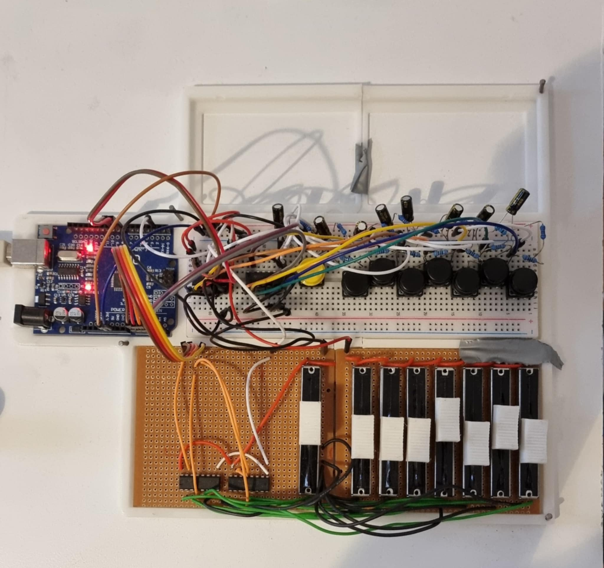

# ProjectSoloJam (Work In Progress)
 Files and info for my solo jam project.

Physical controller to send commands to REAPER, via Open Sound Control. The controller can toggle recording, change track volumes, and set record arming for tracks.

A template REAPER project set up for the controller is found under SoloJamTemplate/SoloJamTemplate.rpp.

## Setup
### Dependencies
Currently, the solution is only designed for Windows.

The following dependencies are required:
 - [oscpp](https://github.com/kaoskorobase/oscpp): library for constructing and parsing OpenSoundControl packets.
 - windows.h

### Compilation

#### Serial2OSC
This project makes use of the winsock2.h library. With MinGW it is compiled as follows:

`g++ -o serial2osc.exe serial2osc.cpp OSCconnection.cpp SerialConnection.cpp -lws2_32`

#### Controller
The code for the controller is run on an Arduino UNO, and can be compiled in the Arduino IDE. The electrical circuit diagram of the controller is shown below:

<!---  -->

[NOTE: Not available currently - will be added soon.]

### Required REAPER Settings
REAPER needs to have OSC control enabled. 

1. Go to Preferences -> Control/OSC/Web. 
2. Add "OSC (Open Sound Control)" Control surface, with mode "Local port"
3. Set Local listen port to `2345`.

## Operation

With REAPER open, run serial2osc.exe. Pressing a button activates record arm for the corresponding track, and deactivates the record arm for the previous track.

## Bill of Materials

| Product | Qty  |
| ------- | ---: |
| FSM103 12x12mm switch  | 8 |
| AKTSC22K switch covers | 8 |
| Arduino Uno            | 1 |
| PTA4553-2010CIB103 Slide Potentiometer | 8 |
| CD4053B Multiplexers | 4 |
| 1 uF Capacitors | 8 |
| 100 Ohm Resistors | 8 |
| 10K Ohm Resistors | 8 |
| Breadboard, prototype board, cables | |
| Base Plate Part 1 | 1 |
| Base Plate Part 2 | 1 |
| SliderKnob | 8 |

## TODO
 - Figure out bug where random nonsense sometimes gets sent through COM port on start-up.
 - Find solution to overwriting part of track immediately overwriting the full thing.
 - In OSCconnection.h, find a way to force "buffer" to be aligned to 32 bits. (Note that the solution is to have it be the first thing in the class definition, but a better solution might be worthwhile since the current one doesn't feel super robust.)
 - Fix model for base by adding tolerance in gap and increasing width of side holes for cables.
 - Design and manufacture PCBs for better reliability.
 - Design and manufacture top-piece for controller for stability and isolation of electronics.
 - Make controller more robust - or formalise standard for communicating with Arduino.
 - Add circuit schematic to this repo.