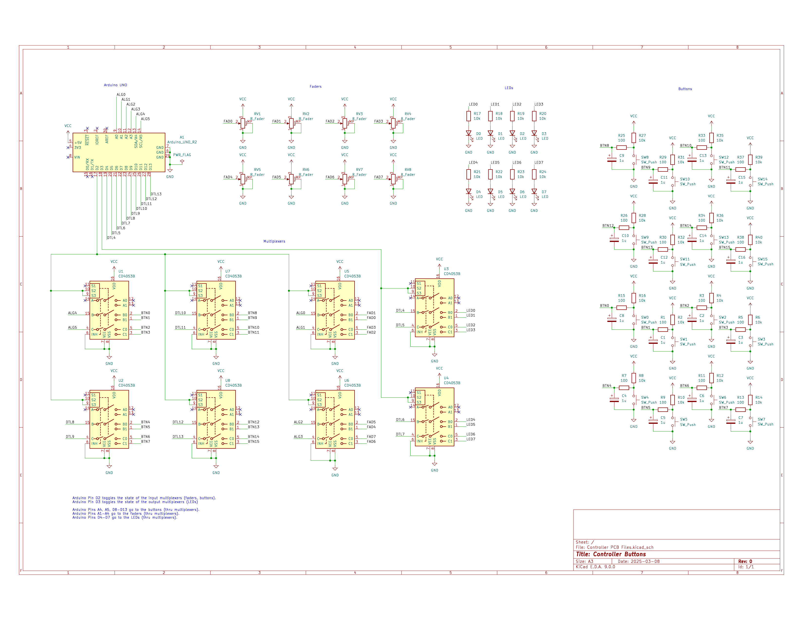

# ProjectSoloJam
 Files and info for my solo jam project.

## Setup
### Dependencies
Currently, the solution is only designed for Windows.

The following dependencies are required:
 - [oscpp](https://github.com/kaoskorobase/oscpp): library for constructing and parsing OpenSoundControl packets.
 - windows.h

### Compilation

#### Serial2OSC
This project makes use of the winsock2.h library. With MinGW it is compiled as follows:

`g++ -o serial2osc.exe serial2osc.cpp OSCconnection.cpp SerialConnection.cpp -lws2_32`

#### Controller
The code for the controller is run on an Arduino UNO, and can be compiled in the Arduino IDE. The electrical circuit diagram of the controller is shown below:

### Required REAPER Settings
REAPER needs to have OSC control enabled. 

1. Go to Preferences -> Control/OSC/Web. 
2. Add "OSC (Open Sound Control)" Control surface, with mode "Local port"
3. Set Local listen port to `2345`.

## Operation

With REAPER open, run serial2osc.exe. Pressing a button activates record arm for the corresponding track, and deactivates the record arm for the previous track.

## TODO
 - Add button for Record vs Play.
 - Turn off recording when switching record arm to new track. (Note that finding a solution to overwriting track (see below) may negate the need for this.)
 - Figure out bug where random nonsense sometimes gets sent through COM port on start-up.
 - Find solution to overwriting part of track immediately overwriting the full thing.
 - Add physical faders.
 - Make physical structure for controller.
 - In OSCconnection.h, find a way to force "buffer" to be aligned to 32 bits.