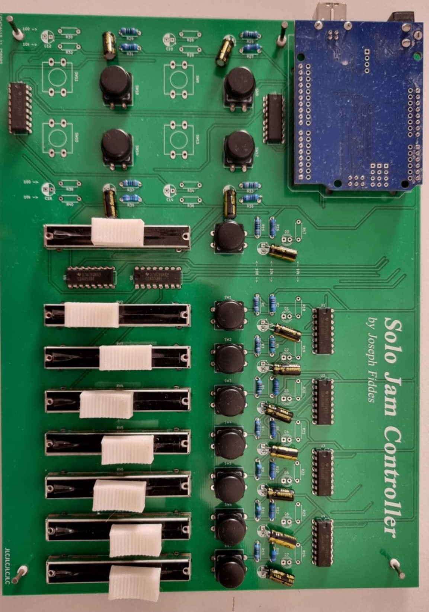

# ProjectSoloJam (Work In Progress)
 Files and info for my solo jam project.

Physical controller to send commands to REAPER, via Open Sound Control. The controller can toggle recording, change track volumes, and set record arming for tracks.

A template REAPER project set up for the controller is found under SoloJamTemplate/SoloJamTemplate.rpp.

## Assembly
Solder the electronic components to the PCB. Note the Arduino UNO is connected via header pins.

Place four of Corner Washer Thing 1 on the piece of wood, and then place the PCB on top, such that the washers are going through the PCB's four corner holes (note: the top-left corner hole is underneath the Arduino UNO - see the image above).

Nail the PCB to the wood piece using nails with a 3mm diameter.

(optional) Place Corner Washer Thing 2 on each of the nails.

## Setup
### Dependencies
Currently, the solution is only designed for Windows.

The following dependencies are required:
 - [oscpp](https://github.com/kaoskorobase/oscpp): library for constructing and parsing OpenSoundControl packets.
 - windows.h

### Compilation

#### Serial2OSC

Prior to compilation, make sure that the port being used by the Arduino matches to port used by Serial2OSC. This can be done by opening serial2osc.cpp, finding the line `#define SERIAL_PORT "COM7"` and changing the `"COM7"` to whatever port the Arduino is using.

This project makes use of the winsock2.h library, and is compiled with MinGW (`g++`). Run `build` to compile the program.

#### Controller
The code for the controller is run on an Arduino UNO, and can be compiled in the Arduino IDE. The electrical circuit diagram of the controller is shown below:

A higher quality version of the image above may be found by [clicking here](./Controller/Controller%20PCB%20Files/Controller%20Schematic.pdf).

### Required REAPER Settings
REAPER needs to have OSC control enabled. 

1. Go to Preferences -> Control/OSC/Web. 
2. Add "OSC (Open Sound Control)" Control surface, with mode "Local port"
3. Set Local listen port to `2345`.

## Operation

With REAPER open, run serial2osc.exe. Pressing a button activates record arm for the corresponding track, and deactivates the record arm for the previous track.

## Bill of Materials

| Product | Qty  |
| ------- | ---: |
| **Electronic Components:** |   |
| FSM103 12x12mm switch  | 16 |
| AKTSC22K switch covers | 16 |
| Arduino Uno            | 1 |
| PTA4553-2010CIB103 Slide Potentiometer | 8 |
| CD4053B Multiplexers | 8 |
| 1 uF Capacitors | 16 |
| 100 Ohm Resistors | 16 |
| 10K Ohm Resistors | 24 |
| 8-long row of Header Pins | 3 |
| 6-long row of Header Pins | 1 |
| Solo Jam Controller PCB | 1 |
| Piece of wood big enough to nail the PCB to | 1 |
| 3mm diameter nails | 4 |
| **3D Printed Files:** |   |
| Corner Washer Thing 1 | 4 |
| Corner Washer Thing 2 | 4 |
| SliderKnob | 8 |

## TODO
 - Edit shape of slider (square normalised output?)
 - Features to add to controller:
   - move playhead to start
   - Remove items from particular track
   - Edit tempo?
 - When recording starts while playback is off, playback turns on automatically - but the controller does not update bIsRecording. Also consider when playback turns off while recording, which leads to a wierd state.
 - Figure out bug where random nonsense sometimes gets sent through COM port on start-up. (low priority - hasn't happened in a while, and not a massive concern anyway)
 - In OSCconnection.h, find a way to force "buffer" to be aligned to 32 bits. (Note that the solution is to have it be the first thing in the class definition, but a better solution might be worthwhile since the current one doesn't feel super robust.)
 - Design and manufacture top-piece for controller for stability and isolation of electronics.